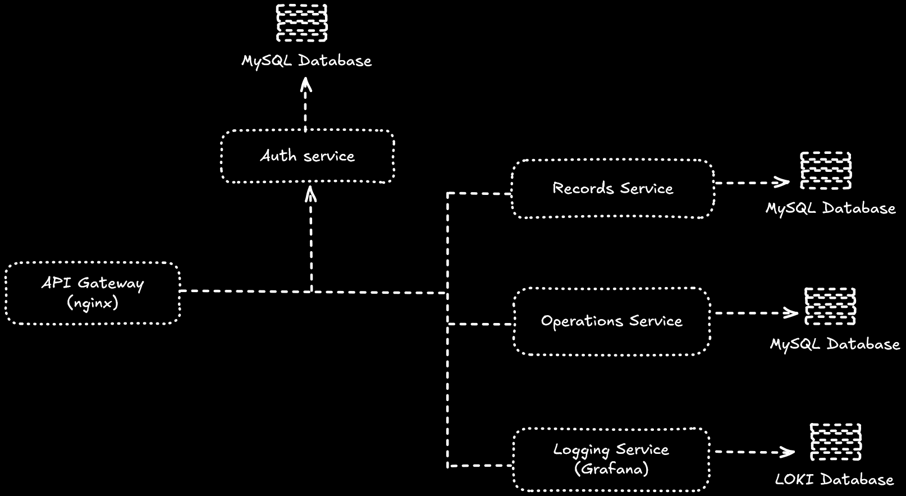

# NTD Software Test

This repository contains a Spring Boot microservice application developed as a test for NTD Software. The microservice exposes a REST API for an arithmetic calculator with a user balance control.

# Prerequisites

- <b>Docker</b>: Ensure Docker is installed on your machine.

# Instructions

To set up and run the application, follow these steps:

1) Clone this repository to your local machine:
```
git clone https://github.com/rafaelcx1/ntd_challenge_backend.git
```

2) Navigate to the project directory:
```
cd <project-directory>
```

3) Run the application using Docker Compose:
```
docker compose up --build -d
```

The application should now be up and running.

# Microservices Architecture
This application follows a microservices architecture, with services for user authentication, operations, and records. 

Below is an overview of the services and their endpoints:
1) <b>API Gateway</b>: All API calls should be made through the gateway: http://localhost:9000/api/v1/**.
2) <b>Microservices Endpoints</b>:
   - <b>Auth Service</b>: Handles user authentication and management.
   ```
    /api/v1/auth
    /api/v1/user
   ```
    - <b>Operations Service</b>: Processes arithmetic operations.
   ```
    /api/v1/operations
   ```
    - <b>Records Service</b>: Manages operation records and balance for each user.
   ```
    /api/v1/records
   ```
3) <b>Internal APIs</b>: These APIs are used for internal microservice communication and are not exposed publicly.
   ```
    Operations Service: /api/internal/v1/operations
    Records Service: /api/internal/v1/records
   ```
# Microservices Design
I followed this microservices design approach to develop this application.


# API Documentation

With the application running locally, you can access the API documentation via Swagger UI at the following URL:

```
Auth Service:
http://localhost:8081/api/swagger-ui/index.html

Operations Service:
http://localhost:8082/api/swagger-ui/index.html

Records Service:
http://localhost:8083/api/swagger-ui/index.html
```


# Solution Overview
Technology Stack:

- <b>Java</b>: Main application language.
- <b>Spring Boot</b>: Main application framework.
- <b>MySQL</b>: Database used for persisting data from all microservices (Auth, operations and records).
- <b>Grafana</b>: As the frontend logging server.
- <b>Loki</b>: As the database for the logging server.
- <b>Nginx</b>: As the api gateway for the application.

# Logging

The service includes a robust logging system from Grafana stack, where it can be accessed through this URL:
```
http://localhost:5000
```
It already includes a simple logging dashboard where its possible to see logs for each microservice. You can access it through "dashboards -> Main Dashboard"

# Tests
The application has unit and integration tests to validate the features.

# Users
There is 3 default users already created in the application. Every user starts with $100.00 of balance.
```
User 1:
Email: user1@user1.com
Password: User1@123

User 2:
Email: user2@user2.com
Password: User2@123

User 3:
Email: user3@user3.com
Password: User3@123
```

# Operation Costs
All costs is already set, as below:
```
Add: $1.00
Subtract: $1.00
Multiply: $3.00
Divide: $3.00
Square Root: $3.00
Random String: $5.00
```